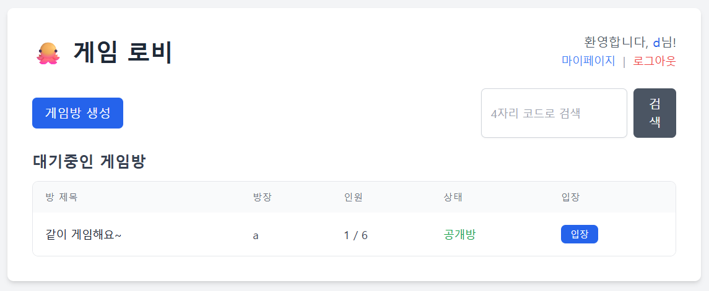
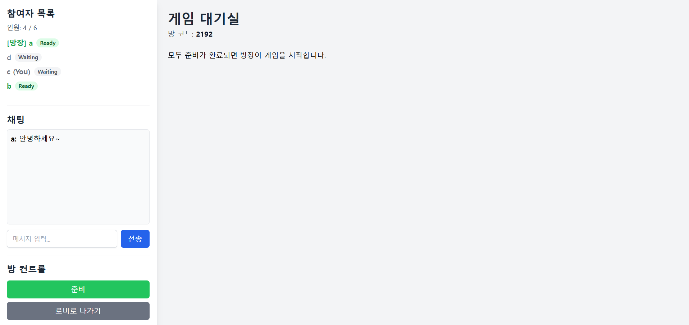
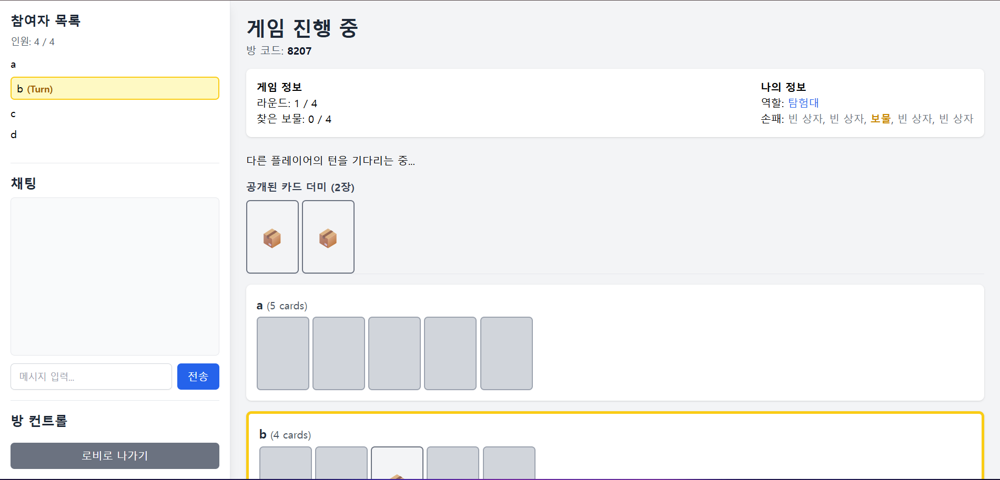

노터치 크라켄 (No-Touch Kraken) - 실시간 웹 보드게임
===================================================
----------------------------------------------------

**Spring Boot, Spring Security (OAuth2), WebSocket, JPA**를 기반으로 구현한 실시간 멀티플레이어 웹 보드게임 '노터치 크라켄'입니다.

이 프로젝트는 Java/Spring 백엔드 개발자가 갖춰야 할 핵심 역량인 **실시간 데이터 처리, 인증/인가, 객체 지향 설계(도메인 모델링), 트랜잭션 관리, 클라우드 배포** 경험을 종합적으로 학습하기 위해 진행되었습니다.

# 실행 방법

### 1. 배포 주소로 접속
1. [http://ec2-43-202-55-108.ap-northeast-2.compute.amazonaws.com](http://ec2-43-201-251-115.ap-northeast-2.compute.amazonaws.com/) 해당 주소로 접속하여 배포된 웹 보드게임 플레이이

### 2. 로컬 환경 (H2 DB)

1. 리포지토리를 Clone 받습니다.
    ```
    git clone [https://github.com/](https://github.com/)[Your-Username]/[Your-Repo-Name].git
    cd [Your-Repo-Name]
    ```

2. ```application-local.properties``` 파일을 생성합니다. (H2 기본 설정으로 충분)

3. ```application.properties```의 ```spring.profiles.active```가 ```local```인지 확인합니다.

4. 프로젝트를 실행합니다.
    ```
    ./gradlew bootRun
    ```

5. ```http://localhost:8080```에 접속하여 게스트 로그인을 사용합니다.

### 3. 프로덕션(배포) 환경 (AWS EC2 + RDS)

1. AWS RDS (MySQL) 인스턴스를 생성하고 테이블을 생성합니다.

2. ```application-prod.properties``` 파일에 RDS 엔드포인트와 DB 접속 정보를 입력합니다.

3. AWS EC2 (Ubuntu) 인스턴스에 ```git```, ```nginx```, ```java 17```을 설치합니다.

4. EC2 서버에서 리포지토리를 ```clone``` 받고 ```Deploy Key```를 등록합니다.
```
cd kraken
./gradlew clean bootJar # .jar 파일 빌드
```

5. ```prod``` 프로필을 활성화하여 ```.jar``` 파일을 백그라운드로 실행합니다.
```
nohup java -jar -Dspring.profiles.active=prod build/libs/kraken-0.0.1-SNAPSHOT.jar > app.log 2>&1 &
```

6. ```nginx``` 설정을 수정하여 80 포트 요청을 8080 포트로 리버스 프록시합니다. (WebSocket 헤더 포함)
```
sudo vi /etc/nginx/sites-available/default
# (location / { ... } 수정)
sudo systemctl restart nginx
```
7. EC2 IP 또는 연결된 도메인(```http://[Your-Domain]```)으로 접속합니다.

# 주요 기능 (Screenshots)
## 로비 (Lobby)

### (방 목록 실시간 갱신)

## 대기실 (Waiting Room)

### (참여자 실시간 동기화, 채팅)

## 인게임 (In-Game)

### (카드 선택, 턴 진행, 역할 확인)


# 핵심 기능 명세

### 1. 유저 시스템 (Spring Security)

- Google OAuth2.0을 이용한 소셜 로그인 (실제 배포용)

- 개발/테스트 편의를 위한 게스트 로그인 (닉네임 입력 시 자동 가입/로그인)

- 최초 로그인 시 고유 닉네임(username) 설정 (Unique 제약조건)

- 마이페이지를 통한 닉네임 변경 및 회원 탈퇴

### 2. 로비 (Lobby)

- **WebSocket (STOMP)** 을 통한 실시간 방 목록 갱신 (방 생성/시작/종료 시)

- REST API를 통한 방 목록 조회 및 4자리 코드로 방 검색

- 방 생성 (공개/비공개, 비밀번호, 최대 인원)

- 방 입장 시 정원, 상태(대기/게임중), 비밀번호 유효성 검사

### 3. 대기실 (Waiting Room)

- WebSocket을 통한 참여자 목록 및 준비 상태 실시간 동기화

- STOMP 기반 실시간 채팅 기능

- 방장(Host) 권한 구현 (강퇴, 최대 인원 변경, 게임 시작)

- 게임 시작 조건 검증 (최소/최대 인원 일치, 방장 외 전원 Ready 상태)

### 4. 인게임 (In-Game Logic)

- **게임 준비 (4-1):**

    - 인원수(4~6명)에 따른 역할(탐험대/스켈레톤) 랜덤 배정

    - 게임 덱(크라켄, 보물, 빈 상자) 생성 및 1라운드 카드 5장 분배

    - 서버 메모리에 게임 상태 저장

- **라운드 진행 (4-2):**

    - WebSocket을 통한 1:1 DTO 전송 (본인 역할, 손패 등 비밀 정보)

    - WebSocket을 통한 1:N DTO 전송 (공용 게임 상태, 턴 정보, 카드 위치)

    - 플레이어의 카드 선택 요청 처리 및 턴 넘김

    - 3초 딜레이: 라운드 종료 시 마지막 카드 확인을 위한 3초 딜레이

- **승리/패배 (4-3):**

    - 크라켄 발견 (스켈레톤 승)

    - 모든 보물 발견 (탐험대 승)

    - 4라운드 종료 시 보물 미발견 (스켈레톤 승)

- **게임 결과 (4-4):**

    - 게임 종료 시 결과 DTO 브로드캐스팅

    - 모든 플레이어의 역할(스켈레톤) 공개 및 승리팀 표시

    - 10초 후 로비로 자동 리다이렉트

### 5. 안정성 및 편의 기능

- 데이터 정합성: 방 입장/생성 시, 기존 ```room_participants```의 "더티 데이터(Dirty Data)"를 정리하여 UNIQUE 제약조건 충돌 방지

- 예외 처리: 방장의 잘못된 요청(ex. 준비된 유저 강퇴) 시, ```@MessageExceptionHandler```를 통해 해당 방장에게만 1:1로 에러 메시지 전송

- 방장 위임: 방장이 비정상적으로 종료할 경우 방에 남아있는 다른 플레이어 중 한명에게 자동으로 권한 위임

- 재접속 처리: 플레이어가 의도치 않게 접속 종료되었을 경우, 세션/토큰을 기반으로 유저를 식별하여 현재 참여중인 게임에 자동으로 동기화하여 입장

# 기술 스택 (Tech Stack)

## Backend
- Java 17
- Spring Boot 3.x
- Spring Security
    - OAuth2.0 (Google), FormLogin (Guest), SecurityFilterChain
  - Spring Data JPA
  - Hibernate, spring.profiles.active를 통한 DB 이중화
- Spring WebSocket
  - STOMP, @MessageMapping, SimpMessagingTemplate

## Frontend

- Thymeleaf
    - 서버 사이드 렌더링, JavaScript에 th:inline으로 데이터 전송
- JavaScript (ES6+)
  - async/await (Fetch), STOMP/SockJS, DOM 조작
- Tailwind CSS
  - CDN을 이용한 Utility-First CSS 스타일링

## Database
- MySQL
    - (Prod) AWS RDS에 구축된 운영 DB
- H2 Database
    - (Local) 인메모리 DB를 사용한 빠른 로컬 테스트

## Deployment
- AWS EC2 (Ubuntu 22.04)
- AWS RDS (MySQL)
- Nginx 
  - 80 -> 8080 리버스 프록시, WebSocket Upgrade 헤더 처리
## Tools
- Gradle
- Git & GitHub

# 아키텍처 및 DB 설계

### 1. 도메인 중심 아키텍처

기본적인 Spring MVC 패턴을 따르되, 기능이 복잡해짐에 따라 **"도메인(Domain)"** 을 중심으로 패키지를 분리했습니다.

```global```: Spring Security, WebSocket 설정 등 전역 설정

```domain/user```: 유저 가입, 로그인, 마이페이지

```domain/room```: 로비, 방 생성, 입장/퇴장 (매치메이킹)

```domain/game```: 대기실 및 인게임 로직 (WebSocket 핵심)

    📁 com.yourproject.kraken
    │
    ├── 📁 global (Config, Auth, Exception...)
    │
    ├── 📁 domain
    │   ├── 📁 user (UserController, UserService, User, UserRepository, ...)
    │   ├── 📁 room (GameRoomController, GameRoomService, GameRoom, ...)
    │   └── 📁 game (GameSocketController, GameService, GameState, ...)
    │
    └── KrakenApplication.java


### 2. DB 스키마 (ERD)

유저와 게임방, 그리고 이 둘을 잇는 ```room_participants``` 테이블로 구성됩니다.
```room_participants```의 user_id에 **UNIQUE 제약조건** 을 걸어, 유저가 동시에 여러 방에 참여하는 것을 DB 레벨에서 방지한 것이 핵심입니다.

        +-------------+ (1)  (Host)(N) +-----------------+
        |   Users     |----------------| GameRooms       |
        |-------------|                |-----------------|
        | user_id (PK)|                | room_id (PK)    |
        | email (UQ)  |                | room_code(UQ)   |
        | username(UQ)|                | password        |
        | role        |                | max_players     |
        | provider    |                | status          |
        +-----------+                  | host_user_id(FK)|
        | (1)                          +-----------------+
        |                              | (1)
        | (Participant)                |
        |                              |
    (1) |                          (N) |
        +---------------------+
        | RoomParticipants    |
        |---------------------|
        | participant_id (PK) |
        | room_id (FK)        |
        | user_id (FK, UQ)    |
        | is_ready            |
        +---------------------+

# 핵심 기술과 설계 과정

이 프로젝트는 4가지 핵심 Spring 기술을 기반으로 설계되었습니다. 각 기술의 채택이 어떻게 프로젝트의 구조에 영향을 미쳤는지 설명합니다.

### 1. Spring Boot: 도메인 분리와 환경 관리

- DI(의존성 주입) 컨테이너이자, `````@RestController````` (로비 API)와 `````@Controller````` (페이지 이동)를 제공하는 웹 서버의 근간으로 사용되었습니다.

- 설계

    - 도메인 중심 패키지 구조: ```GameService``` 하나에 모든 로직을 집중시키는 대신, 기능(도메인)에 따라 ```UserService```, ```GameRoomService``` (방 관리), ```GameService``` (인게임)로 서비스를 분리했습니다.

    - ```spring.profiles.active```: ```application-local.properties```(H2)와 ```application-prod.properties```(MySQL)를 분리하여, 코드 수정 없이 로컬 개발과 AWS 배포 환경을 전환할 수 있도록 설계했습니다.

### 2. Spring Data JPA: DB와 객체 모델링

- ```@Entity``` 어노테이션을 통해 ```User```, ```GameRoom```, ```RoomParticipant``` 3개의 테이블을 RDB 스키마와 1:1로 매핑했습니다.

- 설계

    - DB 스키마 = 도메인 모델: "유저는 동시에 한 방에만 입장 가능"이라는 핵심 비즈니스 규칙을, 코드(Service)가 아닌 DB 스키마 레벨(```@OneToOne```, ```unique=true```)에서 해결하도록 설계했습니다.

    - 연관관계 관리: ```GameRoom```이 ```RoomParticipant``` 목록을 ```CascadeType.ALL```과 ```orphanRemoval=true```로 관리하게 하여, ```GameRoom```을 삭제하거나 ```room.getParticipants().clear()```를 호출하는 것만으로도 JPA가 자동으로 관련 ```RoomParticipant```를 ```DELETE```하도록 설계했습니다. (이는 ```TransientObjectException``` 해결의 핵심이었습니다.)

    - N+1 문제 해결: ```findAllByGameRoom_Id``` 메서드에 ```@Query("...JOIN FETCH p.user")```를 사용하여, 참여자 목록 조회 시 User 정보를 한 번의 쿼리로 가져오도록 최적화했습니다.

### 3. Spring Security: 인증/인가 흐름 제어

- Google OAuth2.0 로그인 및 경로별 권한(```hasRole("USER")```)을 관리하는 데 사용되었습니다.

- 설계

    - 커스텀 핸들러 설계: Spring Security의 기본 흐름을 커스터마이징해야 했습니다.

  1. ```CustomOAuth2UserService```: Google에서 받아온 이메일이 DB에 없으면 ROLE_GUEST로 자동 회원가입시킵니다.

  2. ```CustomOAuth2SuccessHandler```: 로그인 성공 직후, 유저의 ```Role```을 다시 검사하여 ```GUEST```는 ```/register-username```으로, ```USER```는 ```/lobby```로 리다이렉트시켰습니다.

  - 테스트용 게스트 로그인: ```GuestLoginController```를 설계하여, 닉네임만으로 임시 ```OAuth2User``` 인증 객체를 수동으로 생성하고 ```SecurityContextHolder```에 주입했습니다. 이를 통해 OAuth2.0 의존적인 기존 코드를 수정하지 않고도 테스트 환경을 구축했습니다.

### 4. Spring WebSocket (STOMP): 실시간 통신 아키텍처

- 대기실과 인게임의 모든 실시간 동기화에 사용되었습니다.

  - 설계

      - 분리된 컨트롤러: ```GameRoomController```(HTTP 요청)와 ```GameSocketController```(```@MessageMapping```)를 분리하여 책임을 명확히 했습니다.

      - 두 가지 통신 방식:
        - 1:N (Broadcast): ```/topic/room/.../state``` (공용 상태), ```/topic/room/.../game-result``` (게임 결과). ```SimpMessagingTemplate.convertAndSend```를 사용.

        - 1:1 (Private): /user/topic/room/.../game-state (나의 역할/손패), /user/topic/room/errors (방장 에러). ```SimpMessagingTemplate.convertAndSendToUser```를 사용.

    - ```WebSocketSecurityConfig```: WebSocket은 HTTP와 세션을 공유하지 않는 문제를 해결하기 위해, ```AbstractSecurityWebSocketMessageBrokerConfigurer```와 ```spring-security-messaging``` 의존성을 도입했습니다. 이를 통해 STOMP의 ```CONNECT``` 메시지 시점에 HTTP 세션의 ```Authentication``` 객체를 WebSocket 세션으로 안전하게 전파하도록 설계했습니다.

# 트러블 슈팅 및 주요 학습 내용

### 1. WebSocket 인증/인가 문제 (```@AuthenticationPrincipal``` is null)

- 문제: ```@MessageMapping``` 컨트롤러에서 ```@AuthenticationPrincipal```이 null이 되는 현상. HTTP 세션의 인증 정보가 STOMP 세션으로 자동 전파되지 않았습니다.

- 해결: ```WebSocketSecurityConfig```를 추가하고, ```spring-security-messaging``` 의존성을 통해 WebSocket의 ```CONNECT``` 시점에 인증 정보를 검사하고 세션을 연결했습니다.

- 문제2: 구독(```SUBSCRIBE```) 요청이 ```denyAll()```에 막혀 클라이언트 연결이 끊어지는 현상.

- 해결2: ```configureInbound``` 규칙에 ```simpSubscribeDestMatchers```를 추가하여 ```/app/**``` 및 ```/user/**``` 경로의 구독을 명시적으로 허용했습니다.

### 2. 갱신 안 됨 (JPA 트랜잭션과 캐시 문제)

- 문제: 방에 새 유저가 입장/퇴장/준비할 때, ```broadcastCurrentState()```를 호출해도 클라이언트(JS)에 갱신이 안 되는 버그.
- 원인: ```joinRoom```(부모 트랜잭션)이 DB에 커밋(Commit)되기 전에 ```broadcastCurrentState```(자식 트랜잭션)가 DB를 조회하여, 변경 전의 "이전" 데이터를 방송(Broadcast)하는 Race Condition이 발생했습니다.
- 해결: ```roomRepository.save()``` 대신 ```roomRepository.saveAndFlush()```를 사용하여, DB 조회 전에 변경 사항을 DB에 강제로 반영시켜 데이터 정합성 문제를 해결했습니다.

### 3. JPA ```TransientObjectException``` (연관관계 관리)

- 문제: 방 입장/퇴장 시, "저장되지 않은 ```RoomParticipant```를 참조한다"는 ```TransientObjectException``` 발생.

- 원인: ```User```와 ```GameRoom```이 ```RoomParticipant```와 양방향 연관관계를 맺고 있었습니다. DB에서 ```Participant```를 ```delete```해도, ```User``` 객체의 메모리에는 ```participant``` 참조가 남아있는 등, DB와 메모리 간의 상태가 불일치했습니다.

- 해결:

    1. ```RoomParticipant```의 생명주기를 ```GameRoom```만 관리하도록 ```CascadeType.ALL```과 ```orphanRemoval=true```를 설정했습니다.

    2. ```User``` 엔티티에서는 ```Cascade```를 제거하여 ```TransientObjectException``` 충돌을 방지했습니다.

    3. ```room.addParticipant()```, ```room.removeParticipant()``` 등 헬퍼 메서드를 사용하여, DB 작업 시 메모리(객체) 상의 연관관계도 명시적으로 함께 변경하도록 로직을 수정했습니다.

### 4. Google OAuth2.0와 IP 주소

- 문제: EC2 배포 후 구글 로그인이 ```400: invalid_request (redirect_uri_mismatch)``` 오류를 반환.

- 원인: Google Cloud Console은 보안상의 이유로 ```localhost```를 제외한 숫자 IP 주소(```http://43.x.x.x...```)를 리디렉션 URI로 허용하지 않았습니다.
- 해결: AWS EC2가 제공하는 무료 퍼블릭 DNS(예: ```ec2-....amazonaws.com```)를 Google "승인된 리디렉션 URI"에 등록하여 해결했습니다.
